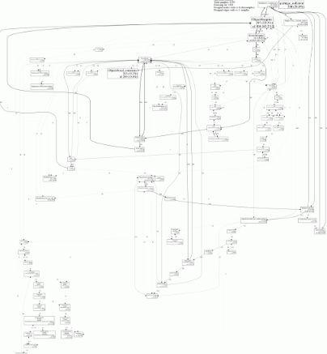

!SLIDE center subsection transition=scrollUp
# RubyConf 2010 #

!SLIDE center subsection transition=scrollUp
# Debugging Ruby Systems #
## Aman Gupta ##

!SLIDE bullets transition=scrollUp
* lsof - list open files
* strace - trace system calls and signals
* tcpdump - dump traffic on a network
* ltrace - trace library calls
* gdb - gnu debugger

!SLIDE center transition=scrollUp
# perftools #
## google's performance tools ##

!SLIDE center transition=scrollUp

!SLIDE center transition=scrollUp
# perftools.rb #

!SLIDE transition=scrollUp

    @@@ ruby
    get '/sleep' do
      sleep 0.25
    end

    get '/compute' do
      long_running_task
    end

!SLIDE transition=scrollUp

    /__start__
    /__stop__
    /__data__

    /profile=true&times=10
    /__data__
