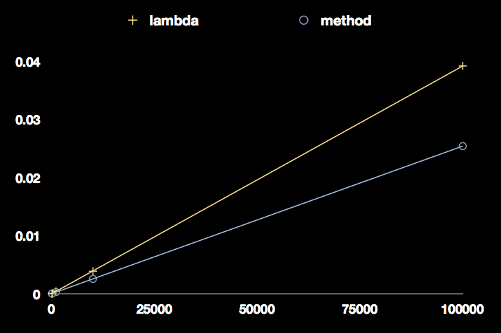
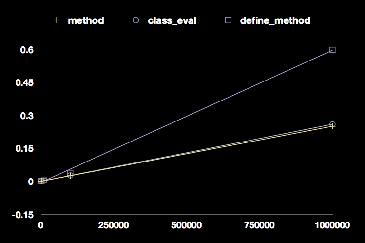
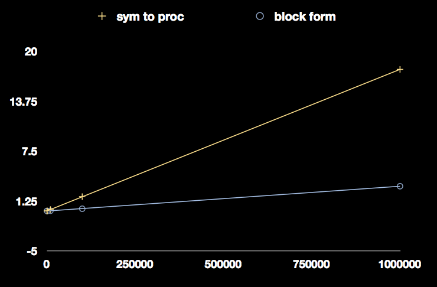
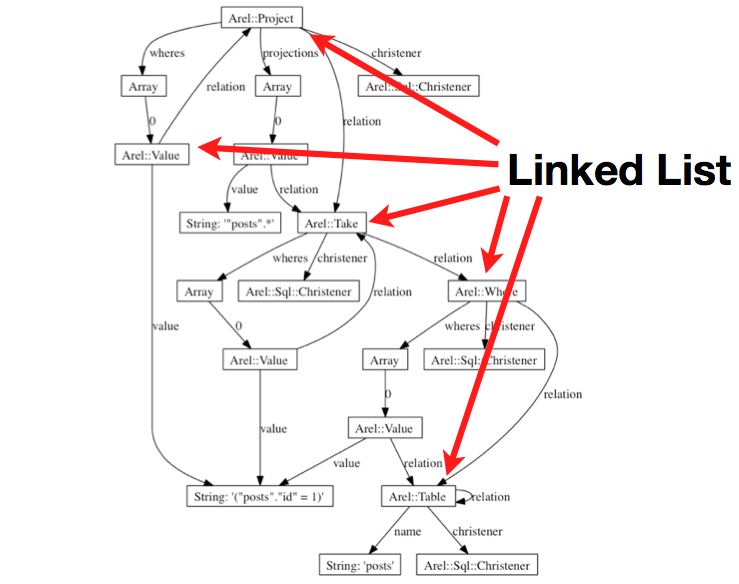
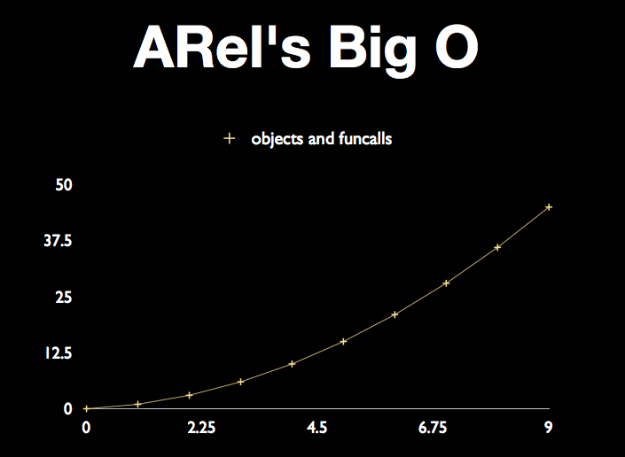
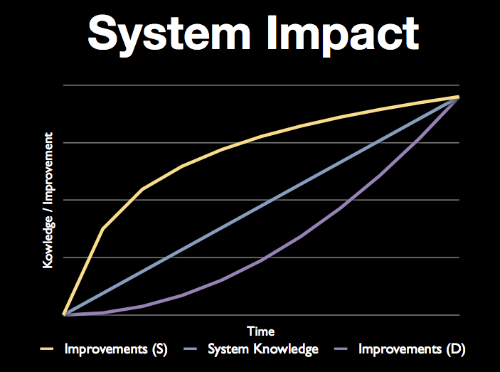

!SLIDE subsection transition=scrollUp
# ZOMG WHY IS THIS CODE SO SLOW? #
## Aaron Patterson ##

!SLIDE transition=scrollUp
# ActiveRecord 5x slower than Rails 2.3.5 #

!SLIDE bullets transition=scrollUp
# Rewrite #
# vs. #
# Superficial improvements #

!SLIDE transition=scrollUp
    lambda { ... }

    # vs

    class Callable
      def call; ... end
    end

!SLIDE center transition=scrollUp

!SLIDE transition=scrollUp
    class Foo
      def foo; end
      define_method :bar do; end
      class_eval %{ def baz; end }
    end

!SLIDE center transition=scrollUp

!SLIDE transition=scrollUp
    @list.map(&:to_i)

    # vs

    @list.map { |x| x.to_i }

!SLIDE center transition=scrollUp

!SLIDE bullets transition=scrollUp
# Rewrite #
# vs. #
# Superficial improvements #

!SLIDE center transition=scrollUp

!SLIDE center transition=scrollUp

!SLIDE center transition=scrollUp

